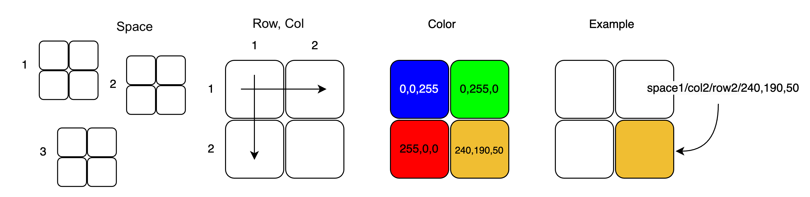

readme.md

# 2x2 Interactile

Device with a 2x2 matrix of RGB Switches, controlled by an ESP32. The switches are arranged in a matrix configuration. WS2811 IC's control the RGB LEDs embedded in the switches, controlled using the Adafruit Neopixel library. 

The enclosure is 3D printed in PLA with an acrylic backplate, secured with M2 screws and a knurled nut to allow for easy battery switching. 

The battery is a CR123 sized 3.7 Li-Ion and provides the entire device with power. A polarity protection circuit protects the PCB but there is no charging circuit. 

 


### Interfacing via MQTT

The current code in the folder named "MQTT" connects the interactiles to an MQTT server, where they publish and subscribe to channels that correspond to the individual pixels. 

The server is located at 
```c++
mqtt_server = "test.mosquitto.org";
mqtt_port = 1883;
base_topic = "interactiles/space1";
```

Configure Wifi settings here
```C++
// Wi-Fi credentials
const char* ssid = "SSID";
const char* password = "PASSWORD";
```

The channel structure is as follows:
interactiles/space[]/row/col/r,g,b



The space ID is currently hardcoded. In future versions it should be possible to set this via a DIP switch or similar.

row and column are matched to a specific RGB Switch as follows:
```c++
int mapToLedIndex(int row, int col) {
  if (row == 1 && col == 1) return 0;
  if (row == 1 && col == 2) return 2;
  if (row == 2 && col == 1) return 1;
  if (row == 2 && col == 2) return 3;
  return -1;
}
```

## Future changes
 
- Current version uses WS2811 LED drivers. Replace with intelligent RGB LED Switches
- Improve power management: Use xiao ESP32S3's onboard charging or redesign charging circuit. Alternatively, completely elminate wireless option
- Fix dip switch behavior
- Spaces architecture: The idea of spaces is that multiple devices can exist in the same space and be a part of the same image. Idea for naming: space1.1, space 1.2, etc.
- Hardcode meta data on each device and have the devices respond to each other accordingly
- MQTT or wifi connecting animation for improved usability
- consider creating a docking station
- Add wifi manager library
