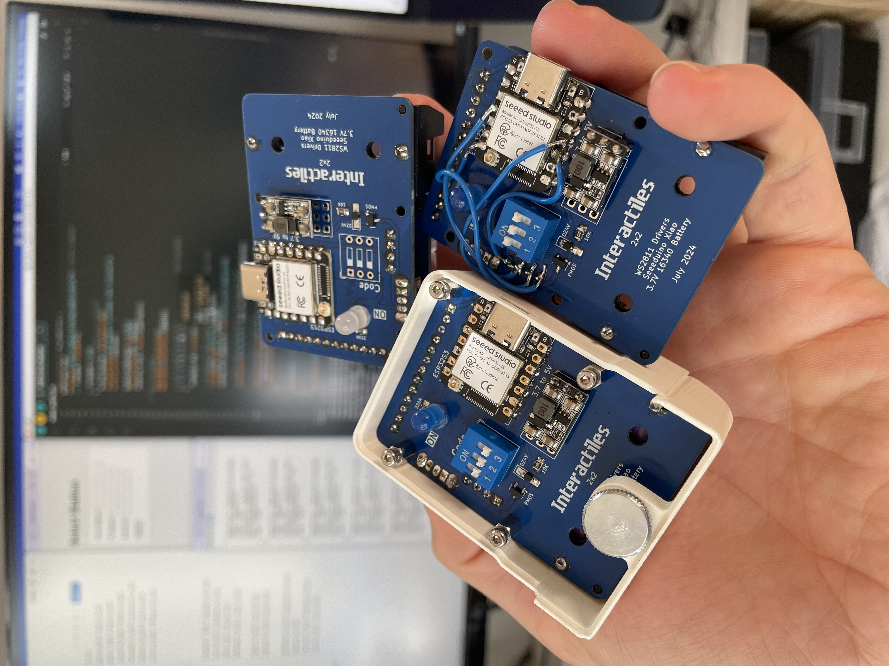
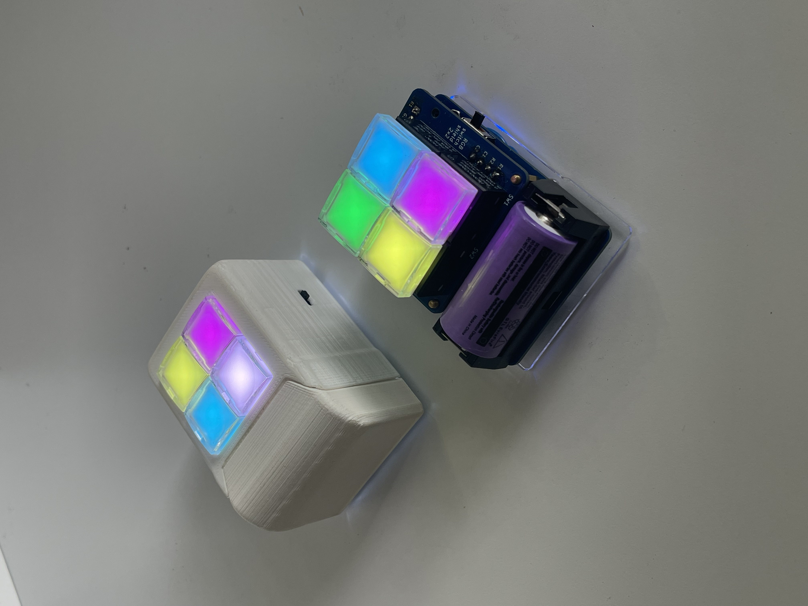

readme.md

# 2x2 Interactile

Device with a 2x2 matrix of RGB Switches, controlled by an ESP32. The switches are arranged in a matrix configuration. WS2811 IC's control the RGB LEDs embedded in the switches, controlled using the Adafruit Neopixel library. 

The enclosure is 3D printed in PLA with an acrylic backplate, secured with M2 screws and a knurled nut to allow for easy battery switching. 

The battery is a CR123 sized 3.7 Li-Ion and provides the entire device with power. A polarity protection circuit protects the PCB but there is no charging circuit. 

 
