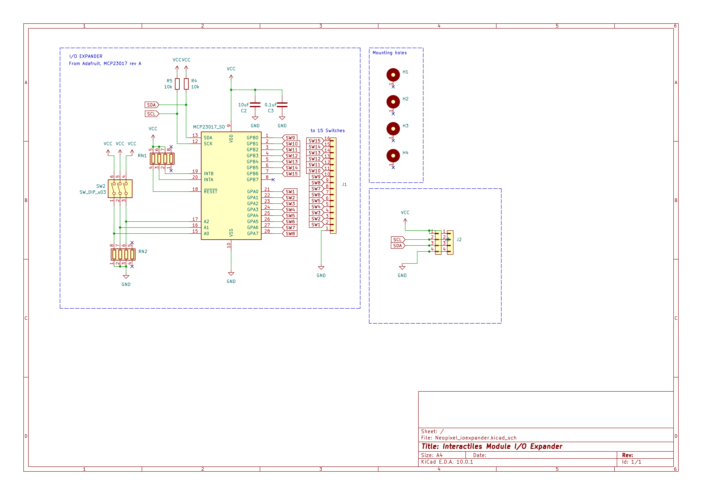

# Module Large I/O Expander PCB

MCP23017-based I/O expander module. Reduces 15 individual switch lines to two I2C lines. I2C address set via DIP switch. Compatible with the Large Module via FPC connector.

## Schematic

## Board

## Bodges

i2c pullups are redundant if using several of these expanders, interrupt pins are tied high and not available for use