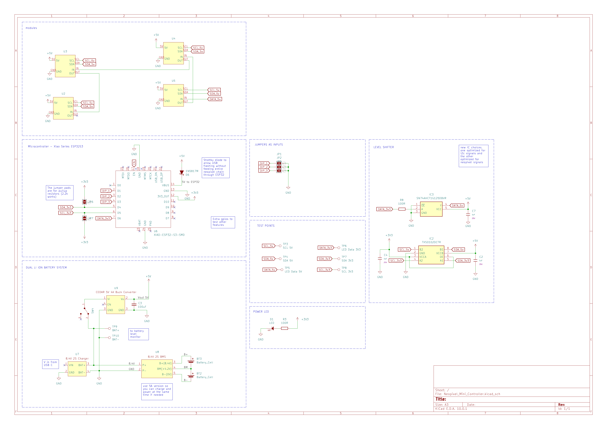

# 4x Mini Controller PCB

ESP32 controller for a string of up to 8 3×5 NeoPixel modules. Interfaces: I2C (for MCP23017 expanders), NeoPixel data line, common ground. Includes USB-C and optional battery charging.

## Schematic

## Board

## Bodges

<!-- Document any wire fixes or component swaps here, with photos -->
