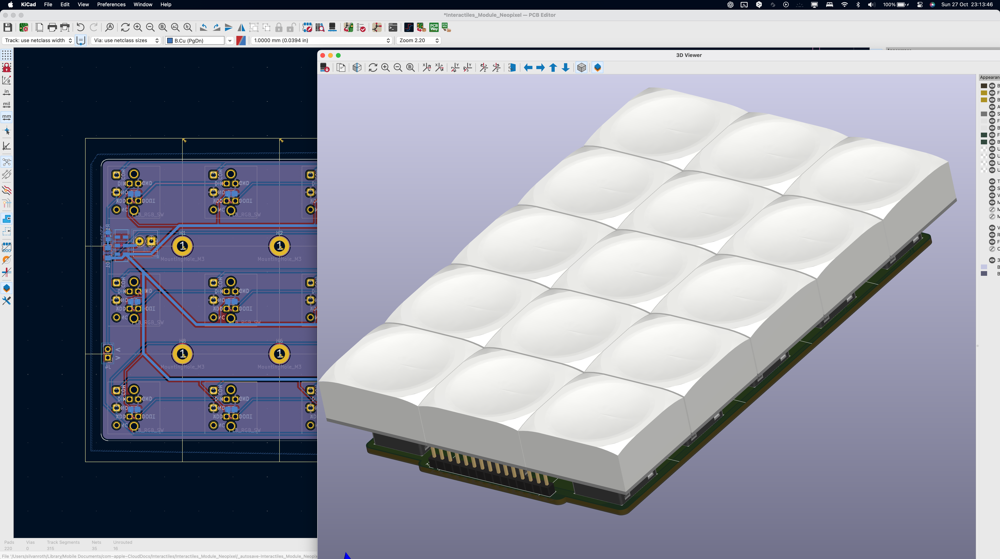
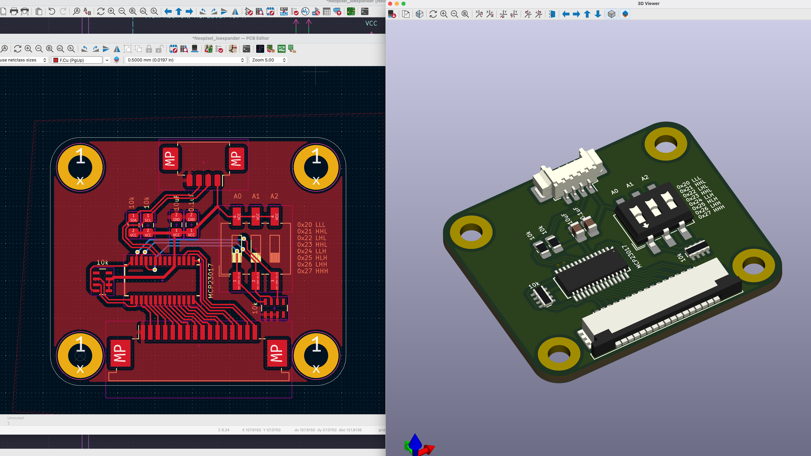
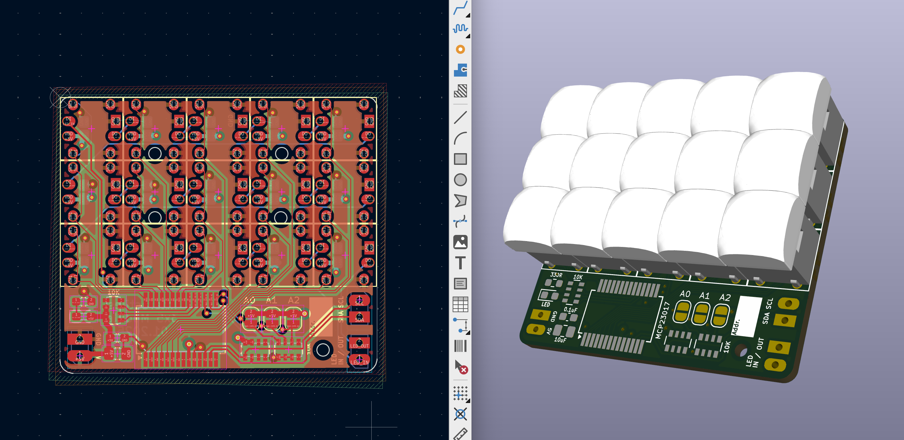
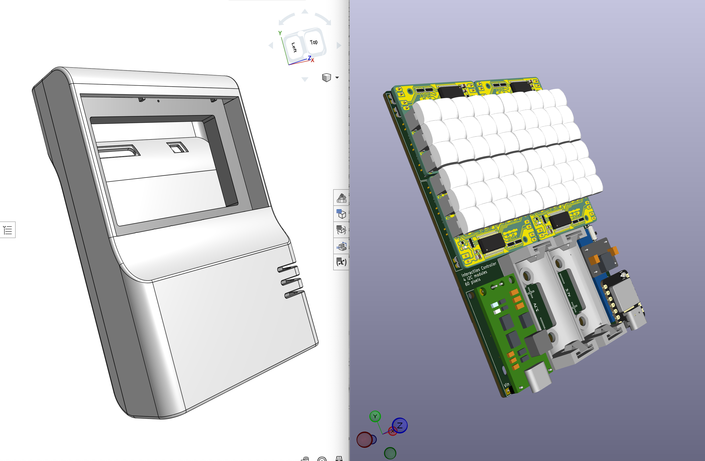
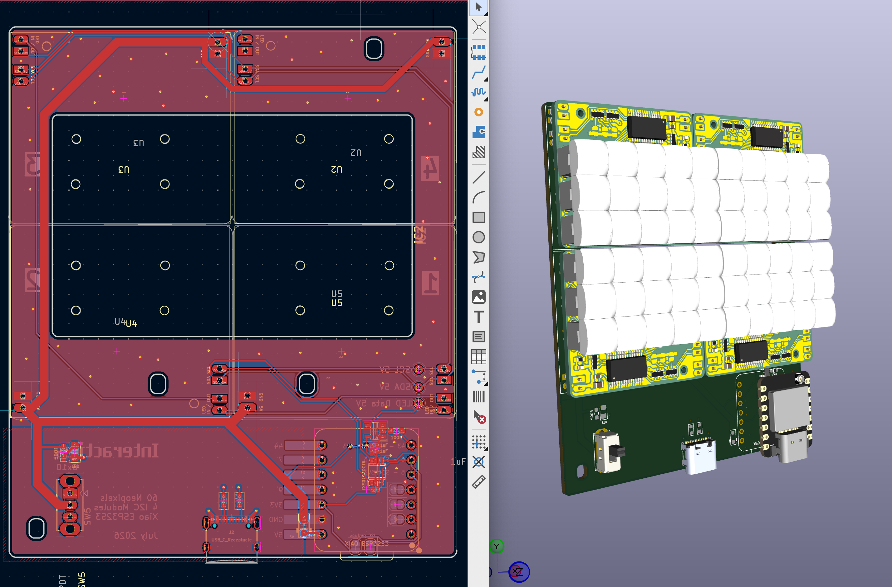
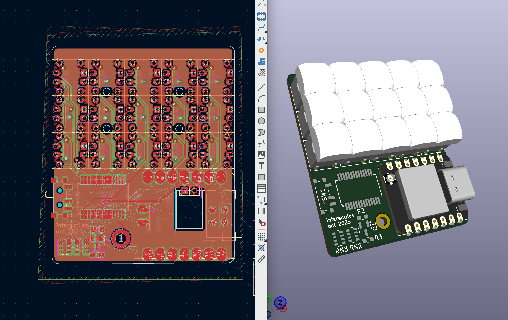

# Button Modules

Addressable RGB switch panels in various sizes, built around 3×5 grids of NeoPixel-compatible switches. Button state is read via MCP23017 I2C I/O expanders. Switches are sourced from Lakeview Electronics in Shenzhen.

---

## Large Module

3×5 grid of PLB switches (~3×3 cm each). 15 switches routed to an FPC connector, with headers for the LED data line and screw terminals for 5V/GND.

→ [Large Module](Large/Module_Large/)

---

## Large Module I/O Expander

MCP23017-based expander board for the Large Module. Connects via FPC connector and reduces 15 switch lines to two I2C lines. I2C address set via DIP switch.

→ [Module Large IOexpander](Large/Module_Large_IOexpander/)

---

## Mini Module

3×5 grid of TL1 switches (7.5mm² each). 4-layer board with MCP23017 mounted directly on the underside. Pinout is non-obvious due to space constraints — refer to schematic.

→ [Mini Module](Mini/Mini_Module/)

---

## Controllers

### 4x Mini Controller

Wireless ESP32 controller for up to 4 Mini Modules (60 pixels). Connects via I2C to MCP23017 expanders, drives one NeoPixel data line. Uses Li-ion batteries with BMS, battery charger etc.

→ [4x Mini Controller](Mini/4x_Mini_Controller/)

### 4x Mini Controller Wired

Wired variant of the 4x Mini Controller, no batteries

→ [4x Mini Controller Wired](Mini/4x_Mini_Controller_Wired/)

### Solo Mini Controller

Standalone controller for a single 3×5 Mini Module.

→ [Solo Mini Controller](Mini/Solo_Mini_Controller/)
