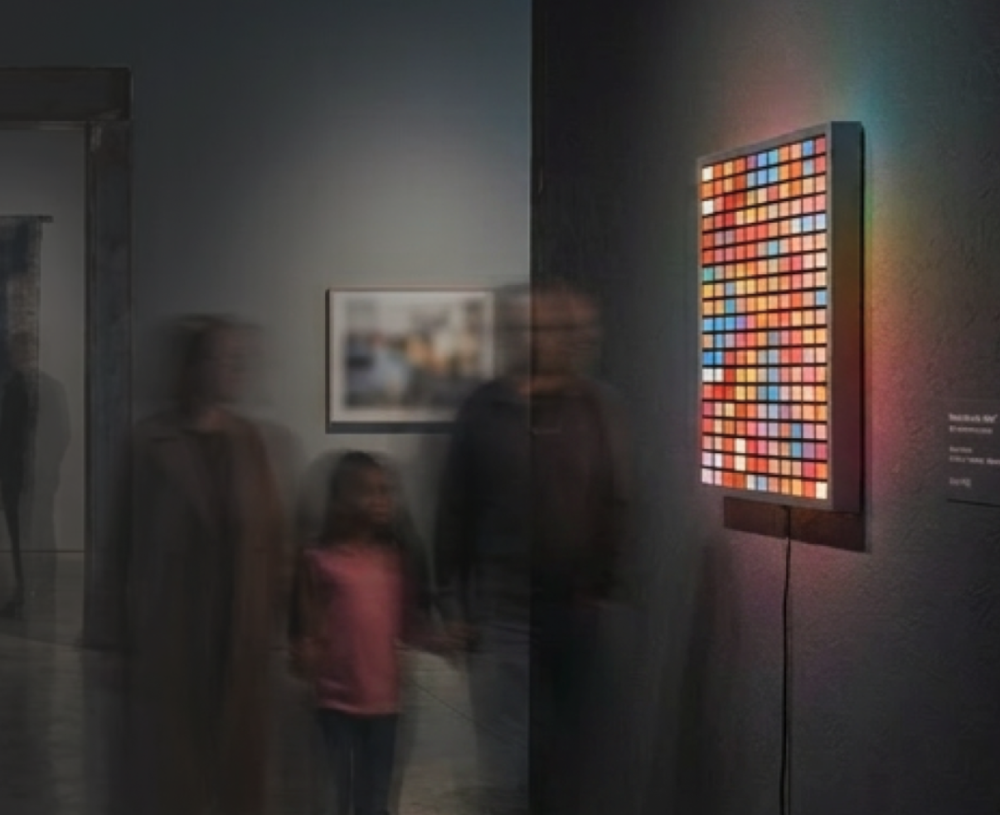
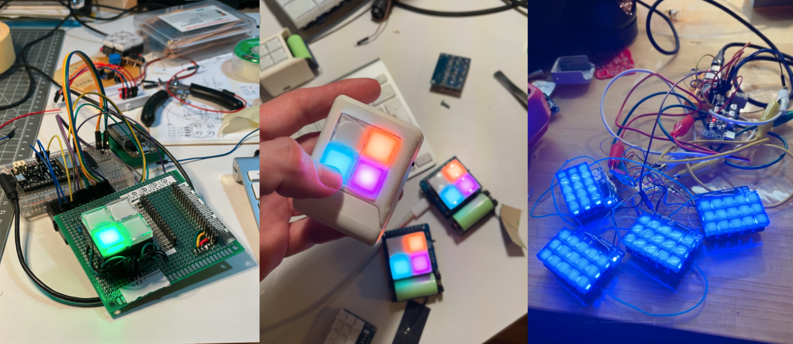
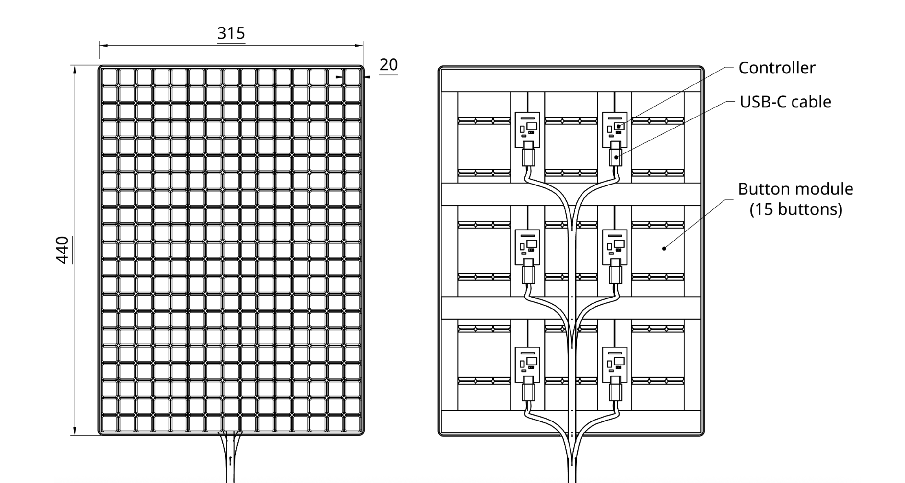

# Interactiles

[Portfolio Link](https://showspace.so/p/9350)

## Idea

Developing an interactive grid of buttons that light up and change colors when pressed, designed to communicate, connect, and create art across distances. Each grid is connected via the internet to a corresponding grid, allowing users to share visual messages in real-time.

## Prototyping

Until now, this project has served mostly as a platform for me to build on my coding and hardware skills. 

The current working prototype is a version with a 2x2 grid of RGB LED switches, connected to each other via an MQTT server.

The vision, of course, is a larger scale grid of clickable illuminated buttons. I am developing this with a modular approach, 4 tiles of 3x15 buttons controlled by a microcontroller that connects to the internet.

 

## To Do
- [x] Experiment with RGB Switches
- [x] Build hand-wired POC
- [x] Design PCB for 2x2 version
- [x] Assemble & test 2x2 version
- [x] Set up web server
- [x] Connect individual interactiles to web server
- [x] Web interface for monitoring
- [x] Large scale version module development (wip)
- [ ] Develop large scale version
- [ ] Design large scale modules
- [ ] Troubleshoot large scale modules
- [ ] Design miniature modules
- [ ] Enclosure for miniature modules
- [ ] Real world testing of 2x2 (in progress)
