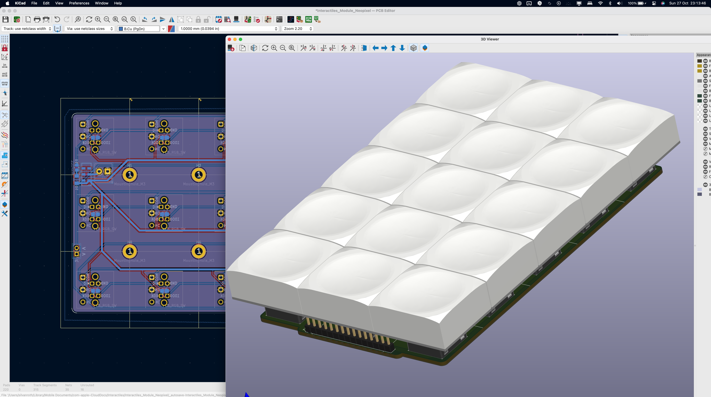
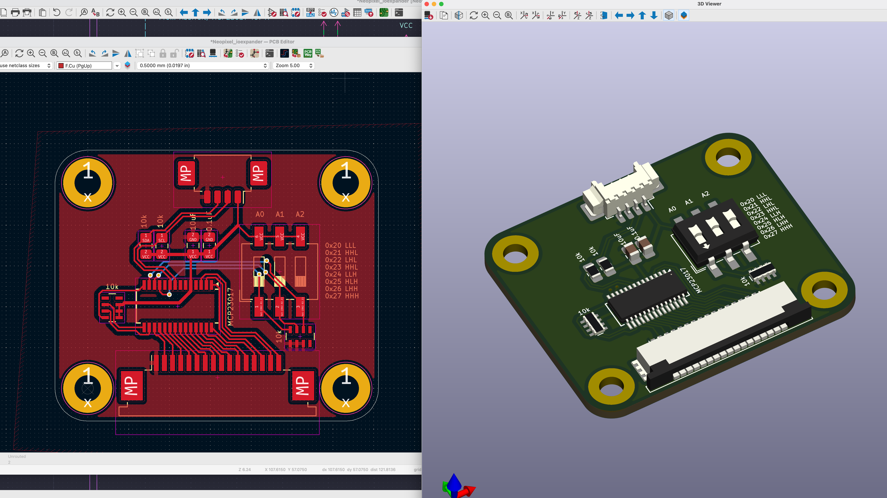
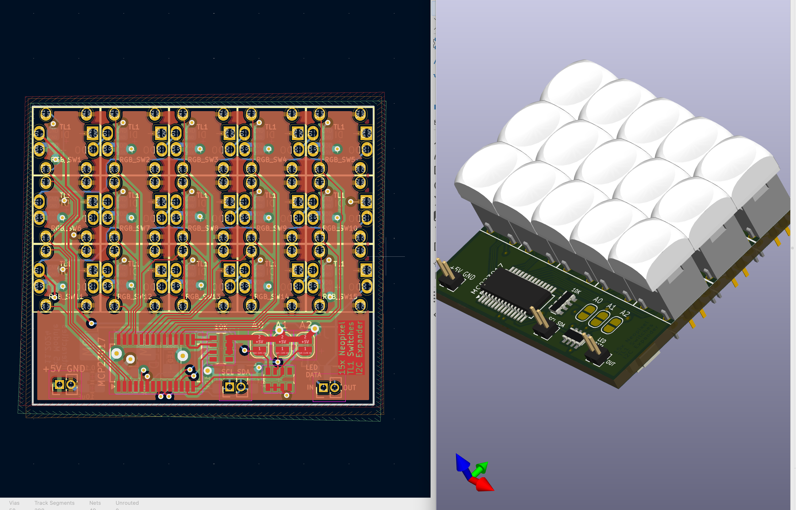

Readme.md

# Modules of addressable RGB switch panels in various sizes

Configurations of 3x5 Switches to create a 15 pixel grid, listening for key interrupts via an MCP23017 i2c I/O expander. The switches are provided by Lakeview Electronics in Shenzhen. They are invididually addressable and compatible with the Neopixel library. 

## Large

Using the largest assembly of the manufacturer's PLB product line, measuring alost 3x3cm per switch. Consist of two elements.

## I/O Expander

Using a MCP23017. For use with the large module or future switch modules. Reduces the 15 individual switch lines to two i2c lines. Using a dip switch to set the i2c address.

https://learn.adafruit.com/adafruit-mcp23017-i2c-gpio-expander
https://github.com/adafruit/Adafruit-MCP23017-Arduino-Library

## Mini

Using the smallest assembly of the manufacturer's TL1 product line, measuring only 7.5mm^2 per switch. the module is so tightly packed that the PCB had to be designed in 4 layers and the i/o expander is directly attached to the bottom of the switch grid. 
Pinout on i/o expander is not intuitive as a result, refer to schematic. 

