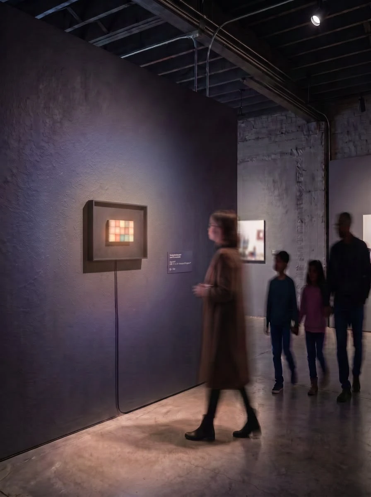

# Zürich Decompression 2026

**Status:** Upcoming — installation planned for 9–11 October 2026.

## The event

[Zürich Decompression 2026](https://zurich-decompression.web.app/) is a Burning Man decompression — a community gathering where burners process the burn through art, performances and workshops. It is volunteer-run, organised by the Zürich burner community, and held at **Kraftwerk, Zürich**.

This year's theme is *The Grand Hotel for Peculiar Burners*, where participants check in with a declared peculiarity that frames their experience. The guiding principle is that **the Hotel is built by whoever turns up** — everything is participant-created rather than organiser-programmed, and there are no spectators at a burn.

Art is submitted through the event's *Grand Hotel Dreams* category, with funding available for materials and transport.

| | |
|---|---|
| **Dates** | 9–11 October 2026 (Fri build night · Sat main event · Sun strike) |
| **Venue** | Kraftwerk, Zürich |
| **Website** | https://zurich-decompression.web.app/ |

## Our proposal

Submitted by **Silvan & Marco** to the Zürich Decompression art grant, September 2026.

The original Interactiles vision is a large-scale grid of several hundred illuminated buttons. For this event we proposed a **deliberately scaled-down version that stays close to the original concept**:

- **Two interactive 5×3 LED grids** — 15 physical buttons/LEDs per block, rather than the ~300 of the full concept.
- The two grids **communicate with each other**, preserving the core idea of connection across distance.
- To compensate for the small pixel count, the work leans on **presentation**: each grid is set in a generous, carefully built frame — in Marco's words, the way tiny portions of the best food are placed on giant plates at a fine dining restaurant.

This is a slight conceptual shift from the full installation, trading raw scale for framing and craft.

### Why this scope

The decisive factor was feasibility within the available timeframe. Marco got the **existing prototype working without significant hardware changes**, which meant the scaled-down version needs no complex component orders with long and risky delivery times. Effort goes into the two things that actually determine whether it works on the night:

1. A **sturdy frame**.
2. **Reliable software**.

Budget: **approximately CHF 500**, covering materials and transport.

### What we want out of it

A chance to test the concept in a **real event setting** and see how people actually interact with it. If it works, we plan to develop the larger installation together for next year's Decompression — with more time to build properly and significantly lower risk overall.

## What we're building

Both halves of the piece are built from boards that already exist in this repo — this is the point of the scaled-down scope, and the reason no new fabrication orders were needed.

### Boards

| Part | Board | Source |
|---|---|---|
| Brain | **Interactiles Controller** | [`Interactiles_Controller/`](../../Interactiles_Controller/) |
| Buttons | **2 × Large Module** | [`Button_Modules/Large/Module_Large/`](../../Button_Modules/Large/Module_Large/) |

**Controller** — built around a **XIAO ESP32-S3** for wifi and the MQTT link between the two grids. Button reads go through **4 × MCP23017** I²C port expanders (64 inputs available, of which this build uses 30), with TXS0102 level shifters on the I²C lines and an SN74AHCT1G125 buffer to lift the LED data line to 5 V. Modules connect over 2×16 IDC headers, with lever terminals for power distribution.

**Large Module** — a 3×5 grid of **PLB-N1PRGB-GTW-AI** illuminated RGB switches (15 per board, ~3×3 cm each), routed out to an FPC connector, with a header for LED data and a screw terminal for 5 V/GND.

Two modules give the **two 5×3 grids** of the proposal: 30 buttons total.

### Power

The controller is powered over **USB-C**, via a **5 m cable** into a **100 W charging brick**. Expected draw is **no more than ~15 W** — the load is dominated by the 30 RGB switches, and the controller itself is negligible beside them. The oversized brick is deliberate: the extra capacity is there for when the installation scales, not for this build.

### Open risks

- **LED data signal loss** on the Large Module is a known, still-unresolved issue (noted in that board's own README). Since reliable software and a working piece on the night are the whole point of this scope, this is the main technical risk to close before the event.
- **Power headroom is not currently accessible.** The controller's USB-C port is a plain 5 V sink — two 5.1 kΩ CC pulldowns, with no PD negotiation IC on the BOM — so it will only ever pull 5 V from the brick, capping it at roughly 15 W no matter how large the supply is. That is fine for this build, but the 100 W will not become available at scale without either a PD trigger/sink IC and a buck stage, or a separate 5 V supply.
- **5 m at 5 V is a long run.** Voltage drop across the cable scales with current, so a thin cable may brown the LEDs out at full brightness even though the brick is oversized. Worth using a cable with heavy (20 AWG or better) power conductors, and worth testing at full white before the event.

## Retrospective

*To be filled in after the event: what we built, what worked, what broke, how people interacted with it, and what we would change for the full-scale version.*
